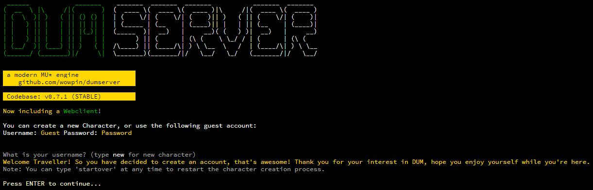
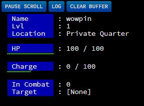
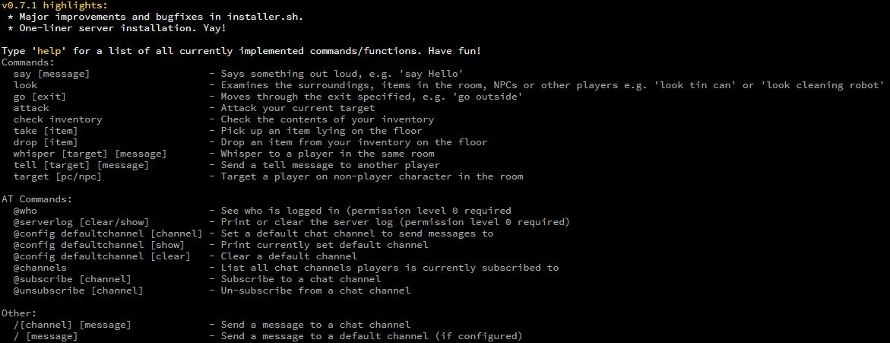
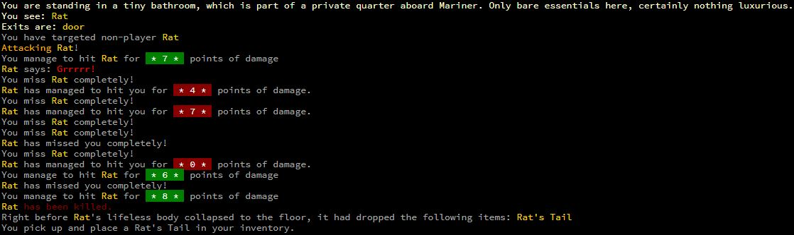

# dumserver   
A modern Python MU* engine - re-imagined, actively developed and properly tracked.

## What is it?
DUM is a hobby project aiming to develop a feature-rich Python codebase for a sci-fi MUD style game. It is building on brillinat work by Mark Frimston, be sure to check out his Mud-Pi project (https://github.com/Frimkron/mud-pi).

## Try it out!
Go ahead an check out dumserver at http://dum.retico.co.uk --> Likely down at the moment, as DUM looks for a new hosting home.

## Features
Head over to the [Wiki](http://dumengine.wikidot.com/dum-v0-1-feature-summary) for small breakdown of core features in the initial version 0.1. All changes/improvements/fixes since 0.1 are being documented in [CHANGELOG.md](CHANGELOG.md)

## Running the Server
```diff
- IMPORTANT - Python >= 3.6.7 is required (Ubuntu >= 18.04 LTS)!
```

```diff
- IMPORTANT - To avoid setup issues, please always install DUM on a fresh, dedicated Ubuntu instance!
```

1. Install the server in a folder of your choice using `curl -s https://raw.githubusercontent.com/wowpin/dumserver/master/installer.sh | bash && python3 <(curl "https://raw.githubusercontent.com/wowpin/dumserver/master/setup.py" -s -N)`
2. As a last step, the installer will try to detect your public IP address and set it in Webclient config files. You can also choose to provide the IP manually. 
4. Go into dumserver home folder and run it by typing `sudo ./start-server.sh`

Note: start-server.sh needs to be ran as root if Webclient is configured to run on port 80 (that's how it comes by default).

You now should be able to connect to your server on `http://<your-server-ip>`

## Screenshots










## Get in touch
Bartek.Radwanski@gmail.com
