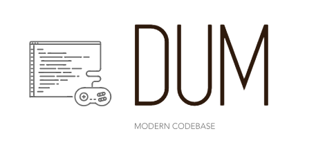

# dumserver 
A modern Python MU* engine - re-imagined, actively developed and properly tracked.

## What is it?
DUM is a hobby project aiming to continue developing a feature-rich Python codebase for a MUD style game. It is building on brillinat work by Mark Frimston, be sure to check out his Mud-Pi project (https://github.com/Frimkron/mud-pi).

> Note: A **Test Server** running this repository of `dumserver` is live! It's accessible via a webclient -> http://dum.dynu.net , alternatively use a MUD client of your choice and point it to dum-devworld01.dynu.net:35123. If you'd like to try DUM out, you can log in and explore a couple of example rooms. Use one of the account credentials below:

- user: `Guest1` / pass: `Password`
- user: `Guest2` / pass: `Password`
- user: `Guest3` / pass: `Password`
- user: `Guest4` / pass: `Password`
- user: `Guest5` / pass: `Password`

If you're struggling to connect, it means I'm probably currently playing with the code etc. Try again in a few minutes and it should be up and running.

## Features
Dumserver is a reimagined and improved version of https://github.com/wowpin/dum-generic - head over there to check out the implemented features (also check out http://dumengine.wikidot.com/dum-v0-1-feature-summary).

## Changelog
There has been a lot of development since the initial `dum-generic` repository. I mean, A LOT. For a full list, see CHANGELOG.md, but to name a few biggies:

- DUM no longer requires a MySQL database instance. All information is stored within JSON files
- Introduction of an in-game Event Scheduler and scripted events. (e.g "make the player unable to move for 5 seconds and damage him for 15 HP each second")
- Dedicated Web-Client - soon to be published in a separate repository

## Running the Server
Running your own instance is really straight-forward.

### For Linux:
1. `sudo apt-get update` and `sudo apt-get upgrade`
2. Install Python3: `sudo apt-get install python3`
3. Install Pip3: `sudo apt-get install python3-pip`
4. Install Commentjson: `sudo pip3 install commentjson`
5. Install git: `sudo apt-get install git-core`
6. Run `git clone https://github.com/wowpin/dumserver.git` to download Dumserver
7. CD into dumserver folder and run the server: `python3 dumserver.py`

You will be greeted by some boot-time messages - your server is up and running!

```
05/12/2018 11:19:23 [Server Boot] 
05/12/2018 11:19:23 [Loading configuration file] 
05/12/2018 11:19:23 [info] Rooms loaded: 6
05/12/2018 11:19:23 [info] Environment Actors loaded: 1
05/12/2018 11:19:23 [info] NPCs loaded: 2
05/12/2018 11:19:23 [info] Items loaded: 2
05/12/2018 11:19:23 [info] Scripted Events loaded: 6
05/12/2018 11:19:23 [info] Registered player accounts loaded: 0
05/12/2018 11:19:23 [info] Executing boot time events
05/12/2018 11:19:23 [info] State Save interval: 5 seconds
```

You now should be able to connect to your server on `<server IP/hostname>:35123`

## What now?
I'd love to carry on developing this, it has been pretty fun so far. If anyone feels like they want to take it even further, feel free to get in touch.

## Get in touch
Bartek.Radwanski@gmail.com
